# Quant Factor Ranking — S&P 500

> Cross-sectional multi-factor equity model on the point-in-time S&P 500, 2010–2026.
> The long-only top-quintile cap-weighted portfolio of a 5-factor composite produces **+1.65 % annualised CAPM α** vs SPY net of 10 bps/side costs. The dollar-neutral long-short variants exhibit positive CAPM α but modest standalone economics — they are presented as **diagnostics** of cross-sectional information content, not as fully optimised market-neutral strategies.

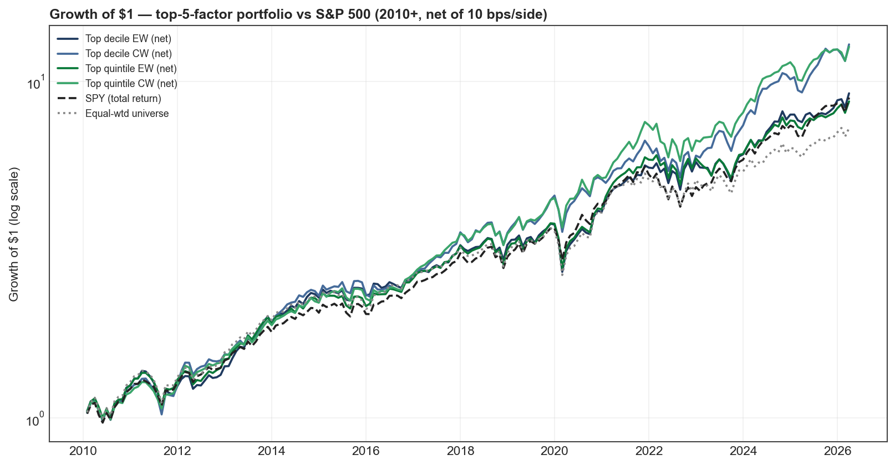

---

## Table of contents

1. [Headline result](#headline-result)
2. [Data pipeline](#1-data-pipeline)
3. [Validation & cleaning](#2-validation--cleaning)
4. [Factor construction](#3-factor-construction)
5. [Per-factor testing](#4-per-factor-testing)
6. [Significance & screening](#5-significance--screening)
7. [Composite & portfolio construction](#6-composite--portfolio-construction)
8. [Long-only results](#7-long-only-results)
9. [Long-short diagnostics](#8-long-short-diagnostics)
10. [Why the long-short underwhelms](#9-why-the-long-short-underwhelms-on-a-standalone-basis)
11. [Next steps to make the long-short investable](#10-next-steps-to-make-the-long-short-potentially-investable)
12. [Honest caveats](#11-honest-caveats)
13. [Repo structure & how to reproduce](#12-repo-structure--how-to-reproduce)
14. [Cross-market extension — ASX 200](#13-cross-market-extension--asx-200)

---

## Headline result

The 5-factor composite (ROIC + ROE + FCF yield + revenue growth + EPS growth, equal-weight z-scores) delivers, net of 10 bps/side, vs SPY total return:

| Strategy | CAGR | Sharpe | β vs SPY | **CAPM α** | ΔCAGR vs SPY | Comment |
|---|---|---|---|---|---|---|
| **Top quintile, cap-weighted** | **16.9 %** | **1.06** | 1.05 | **+1.65 %** | **+2.5 %/yr** | Most practical implementation in this version of the project |
| Top decile, cap-weighted | 17.0 % | 1.00 | 1.12 | +1.02 % | +2.6 %/yr | More concentrated, slightly more drawdown |
| **SPY (benchmark)** | 14.4 % | 1.01 | 1.00 | 0 | 0 | |
| LS Q1−Q5 EW (dollar-neutral) | 1.9 % | 0.32 | −0.08 | +3.23 % | — | **Diagnostic**, not standalone investable — see §8 |
| LS D1−D10 EW (dollar-neutral) | 2.3 % | 0.29 | −0.11 | +4.36 % | — | **Diagnostic**, more concentrated, rougher path |

**Practical takeaway.** The long-only cap-weighted books are the practical result in this version of the project. The dollar-neutral long-short portfolios generate positive CAPM α, but their standalone realised return profile (modest CAGR, low Sharpe, meaningful drawdowns) means they should be read as **evidence the composite contains cross-sectional information**, not as fully optimised market-neutral strategies. They need further risk and turnover work to be considered investable.

**Signal quality.** Independent of any portfolio construction choice, the composite's **rank IC** (Spearman correlation with forward returns) is significant at every horizon tested: **1.37 % @ 1m (t = 2.44)**, **2.58 % @ 3m (t = 4.41)**, **1.90 % @ 12m (t = 3.81)**. See [§6.2](#62-composite-rank-ic--signal-quality-diagnostic) for the IC decay profile and time-series.

The five-factor recipe and weighting are constant across all variants:
> `composite(i, t) = (1/5) × Σ_k z_k(i, t)` — equal-weight cross-sectional z-scores of ROIC, ROE, FCF yield, revenue growth, EPS growth, winsorised and standardised within each month.

---

## 1. Data pipeline

### 1.1 Point-in-time S&P 500

We reconstruct membership month by month from FMP's `historical-sp500-constituent` change log — at each rebalance date, we know which companies were in the index *as of that date*. Names dropped later (acquisition, bankruptcy, etc.) remain in the universe for the months they were members, so the construction reduces survivorship bias relative to a naïve current-membership pull. (Strictly survivorship-bias-free results for broader universes would need CRSP via WRDS; see §11.)

- 1,049 unique symbols ever in the index over 2000–2026
- Reverse-chronological walk of the change log from current 503 members
- A symbol is `investable` at month *t* if it has (a) a price within ±7 days of month-end, (b) a fundamental filing with `acceptedDate` ≤ *t*, and (c) that filing is not >4 quarters stale

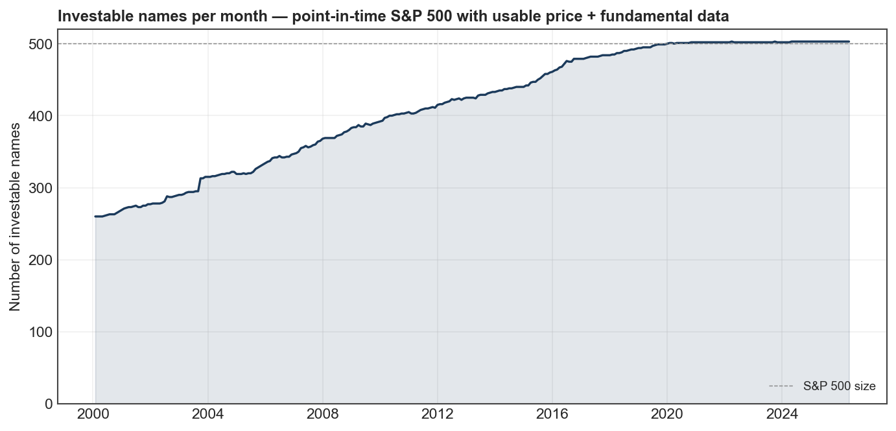

> ~470 investable names/month on average in the 2010+ window; ~100 % coverage from ~2015 onwards.

### 1.2 Prices

| Series | Endpoint | What it is | Used for |
|---|---|---|---|
| `adjClose` | `historical-price-eod/dividend-adjusted` | Split- *and* dividend-adjusted total-return index | Forward returns, momentum, volatility |
| Raw `close` (split-adjusted only) | `historical-price-eod/full` | Actual price level, back-adjusted only for splits | Refreshing value-ratio numerators with live prices |

### 1.3 Fundamentals (PIT-lagged)

Seven quarterly datasets per symbol (`income-statement`, `balance-sheet-statement`, `cash-flow-statement`, `ratios`, `key-metrics`, `enterprise-values`, `financial-growth`). Every value is lagged to its SEC `acceptedDate` — a fundamental enters a factor calculation only once it has been published. Median filing lag in the panel is ~49 days.

### 1.4 Analyst grades

FMP's `grades` endpoint = dated upgrade / downgrade / maintain / initiate actions per symbol, back to ~2012. Aggregated into trailing-window counts for the recommendation-revision sentiment factor.

---

## 2. Validation & cleaning

### 2.1 Yahoo Finance cross-check

Pulled Yahoo monthly returns for every S&P 500 symbol Yahoo could find; computed FMP-vs-Yahoo per-symbol monthly-return correlations:

- 89 % of symbols correlate ≥ 0.99 between FMP and Yahoo
- Median |monthly return difference| = 0.14 %
- 112 historically-delisted names absent from Yahoo (FMP coverage advantage)

Substantial disagreements were investigated individually. Causes were corporate-action back-adjustment differences (MO, HPQ), one outright corrupted FMP series (CPWR — excluded), and ticker mismatches.

### 2.2 Conservative cleaning rule

- 1 symbol (**CPWR**) excluded entirely as corrupted
- 38 individual months nulled where they look like spin-off / corporate-action artefacts
- Final `master_clean.parquet`: 158,243 member-months, 1,049 symbols, 2000–2026, with `investable` flag

### 2.3 Corporate-action audit

Stress-tested splits at AAPL (7:1 in 2014; 4:1 in 2020), NVDA (4:1 in 2021; 10:1 in 2024), AMZN (20:1 in 2022), GOOGL (20:1 in 2022), TSLA (3:1 in 2022):

- Prices smooth across every split — `adjClose` correctly back-adjusts
- Per-share fundamentals GAAP-restated — EPS, BVPS, weighted-average shares continuous (no fake split jumps)
- We use `epsDiluted`, so genuine dilution (rights issues, convertible conversion) is reflected
- One real finding: FMP's value ratios bake in the period-end price and hold it stale until the next filing — addressed in §3.3.

---

## 3. Factor construction

### 3.1 Factor families (7) — 26 individual factors

| Family | Components |
|---|---|
| Value (5) | earnings yield, FCF yield, book-to-market, sales yield, EBITDA/EV |
| Quality (8) | ROE, ROIC, ROA, gross / op / net margin, interest coverage, low leverage |
| Momentum (3) | 12-1m, 6-1m, 3-1m price momentum |
| Growth (4) | revenue, EPS, net-income, EBITDA growth |
| Risk (2) | low volatility, low leverage |
| Sentiment (3) | analyst rating revisions: 3m, 6m, 12m breadth |
| Size (1) | small size (−log market cap) |
| Reversal (1) | short-term reversal (−1m return) |

All components are oriented so that higher = better expected return.

### 3.2 Standardisation pipeline

For each component, within each rebalance month:

1. **Winsorise** at the 1st and 99th percentiles (tame the fat-tailed raw fundamentals)
2. Convert to either a **cross-sectional percentile rank in [0, 1]** (for individual factor screening) or a **cross-sectional z-score** (for composite construction)

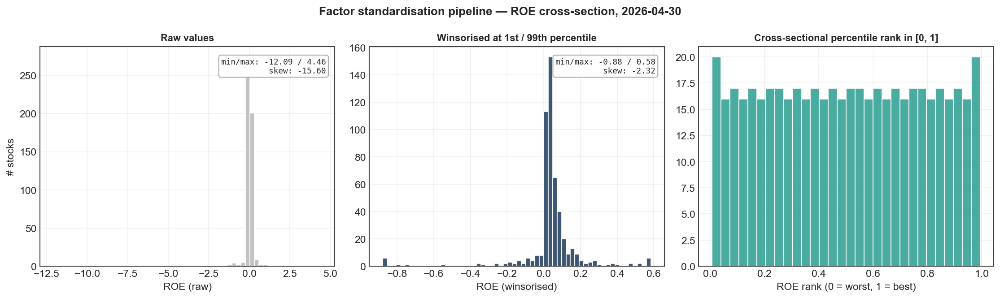

> ROE in the latest cross-section: raw values are heavily skewed, winsorisation tames them, the percentile rank gives a clean uniform distribution. Identical pipeline for every other component.

### 3.3 Fresh-price refresh for value factors

FMP computes its value ratios at the period-end and serves the same value for every subsequent month until the next filing arrives — the price inside the ratio is ~2–3 months stale. For each value yield we rescale by `price(period-end) / price(now)` (split-adjusted, dividend-unadjusted) so the rebalance-date price is current.

*Example, AAPL Aug 2020:* FMP's stale `priceToBookRatio` = 21.1 (computed off the June quarter-end ~$88 price); the actual price at end-Aug was ~$125, so the live P/B was ~31. The refresh corrects this for 93.4 % of 2010+ rows.

---

## 4. Per-factor testing

For each of the 26 individual factors, `charts/factors/<family>/<factor>/` contains nine artefacts:

| File | What it is |
|---|---|
| `chart1_rank_ic.png` | Monthly rank IC (bars) + 12 m rolling (line) + t-stat(IC) box |
| `chart3_ic_decay.png` | Average IC at lags 1–12 months (bars) + success rate per lag (line) |
| `chart5_deciles.png` | 10 equal-weight deciles, cumulative growth-of-$1 vs the universe |
| `chart5_quintiles.png` | 5 equal-weight quintiles, same |
| `table1_quintile_stats_equal_weighted.png` | Full Q1–Q5 + Q1−Q5 + Market stats: total/active return, TE, IR, t-stat, monthly success, turnover, vol, Sharpe, CAPM α/β |
| `table1_quintile_stats_cap_weighted.png` | Same but cap-weighted within fractile |
| `chart7_pure_factor_index.png` | Cumulative index of the *pure factor return* — Fama–MacBeth cross-sectional regression of forward returns on the normalised factor plus size, sector, book-to-price controls; + annualised return/TE/IR/success/t-stat |
| `chart8_raw_factor_index.png` | Same for the raw (univariate) factor return |
| `chart9_pure_factor_returns.png`, `chart10_raw_factor_returns.png` | Monthly pure / raw factor returns (bars) + 12 m rolling (line) |

**Example tearsheet for Return on Equity** (quality / `return_on_equity/`):

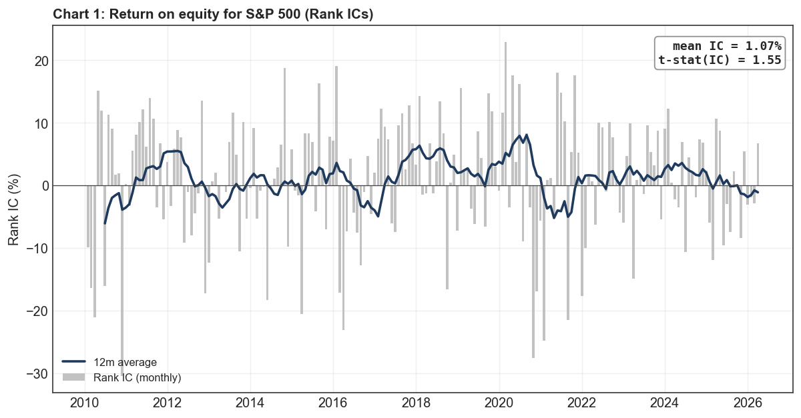
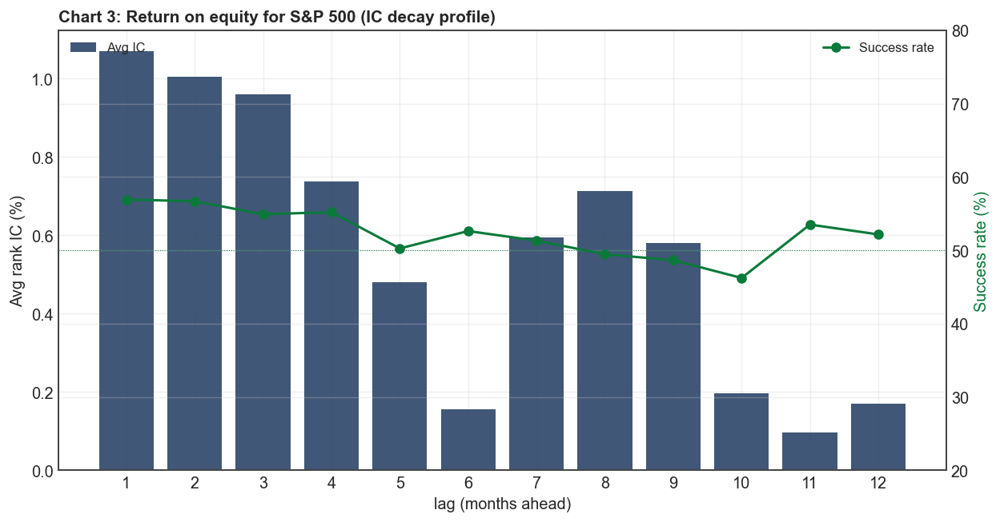
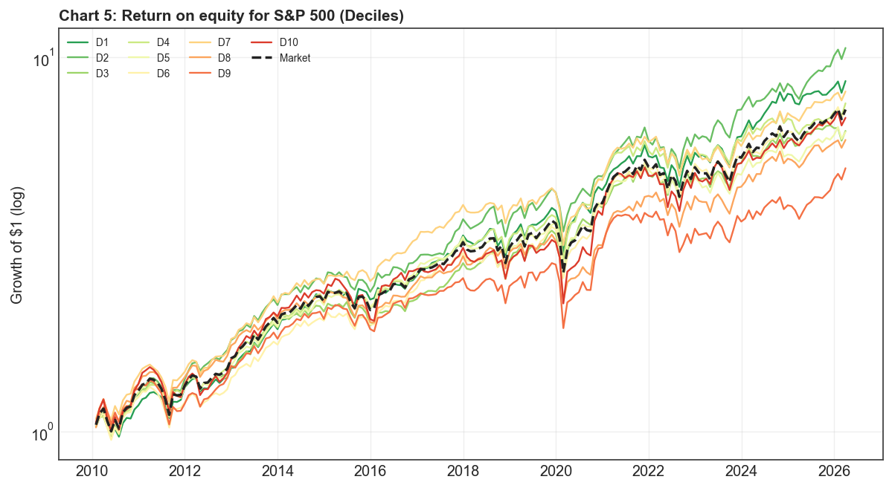
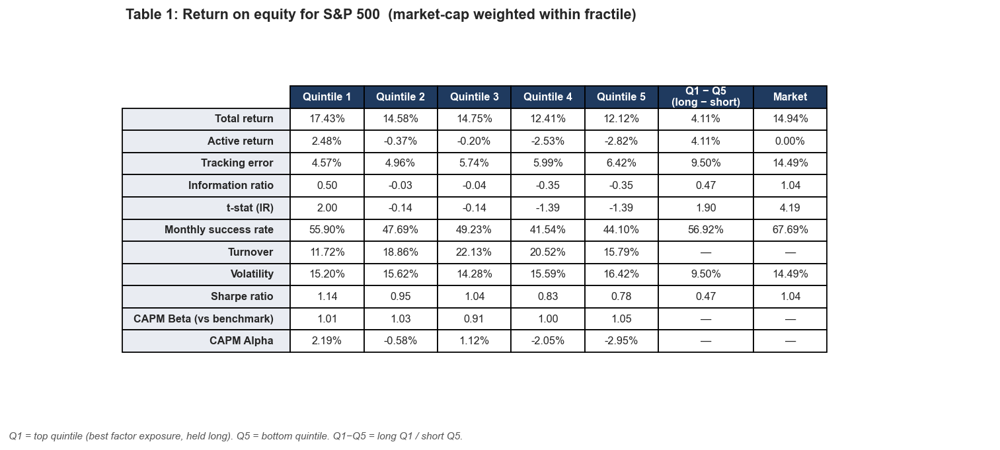
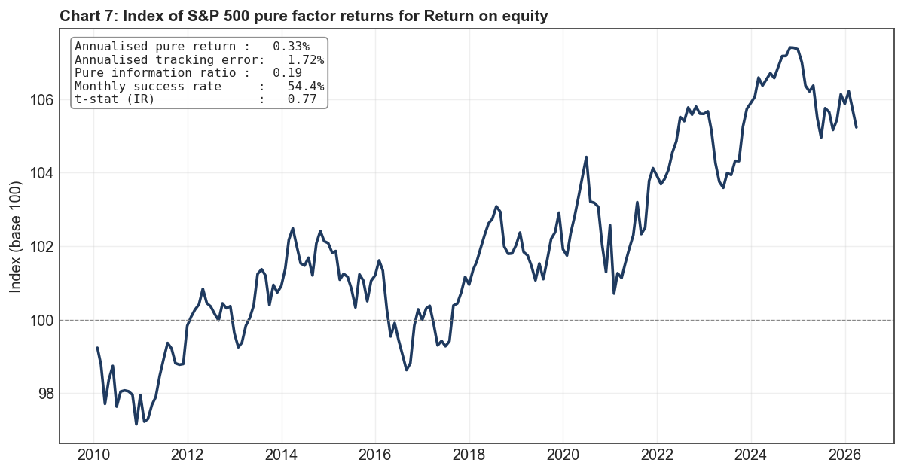

---

## 5. Significance & screening

### 5.1 Summary screen

`charts/factor_screen.png` — one-page summary of all 26 factors plus 7 family composites: rank IC (1m & 2m), hit rate, t-stat, top/bottom-decile active return, tracking error, information ratio, monthly success rate, one-way turnover. Two panels (Signal / Portfolio), grouped by family, shaded rows for factors meeting the criteria.

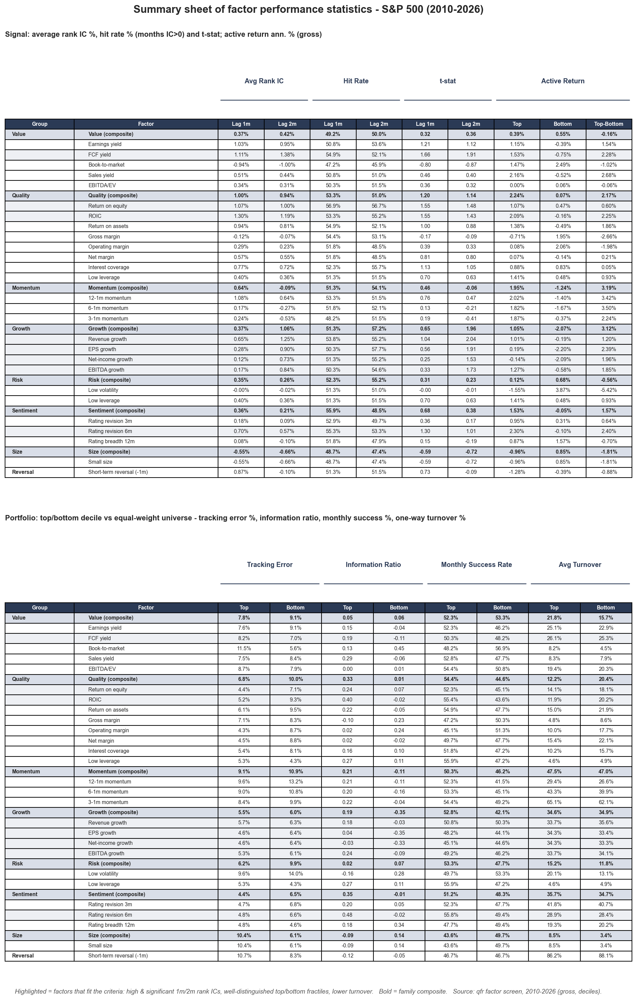

### 5.2 Significance reality

`charts/table5_significant_factors.png` lists every factor where any of {1m-IC t-stat, 2m-IC t-stat, pure-return t-stat} ≥ 1.5, with cells highlighted where any individual test crosses |t| ≥ 2.

In the 2010–2026 S&P 500 large-cap sample, only **Revenue growth** clears strict |t| ≥ 2 on its own (on 2m IC, t = 2.04). Eight others sit in the 1.5–2.0 borderline zone (FCF yield, ROE, ROIC, EPS growth, EBITDA growth, sales yield, net-income growth, gross margin with negative sign). This is consistent with the range seen in published factor literature for the modern U.S. large-cap regime — an audit (oracle: IC = 100 %, random: IC ≈ 0 %) confirms the pipeline is correct.

The arithmetic: with N = 195 months and monthly IC σ ~ 9–10 %, you need mean IC ≥ 1.43 % to reach t = 2. Best single factors are 1.0–1.3 %. Diversification across factors (the Fundamental Law of Active Management, `IR ≈ E[IC] × √N_independent`) is the route to crossing t = 2.

---

## 6. Composite & portfolio construction

### 6.1 Composite

The 5 highest-significance individual factors:

| Rank | Factor | Family | Max \|t\| |
|---|---|---|---|
| 1 | ROIC | Quality | 1.55 |
| 2 | ROE | Quality | 1.55 |
| 3 | FCF yield | Value | 1.91 (2m) |
| 4 | Revenue growth | Growth | **2.04 (2m)** |
| 5 | EPS growth | Growth | 1.91 (2m) |

**Composite = equal-weight cross-sectional z-score across the 5 factors**:

```
for each month t, for each stock i:
    z_k(i,t)        = ( raw_k(i,t) - mean_t ) / std_t      # winsorised, k = 1..5
    composite(i,t)  = (1/5) × Σ_k z_k(i,t)                  # equal weight, 20 % each
```

### 6.2 Composite rank IC — signal-quality diagnostic

The **Information Coefficient** is the cross-sectional Spearman rank correlation between the composite score at month *t* and the realised forward return — a single, robust number measuring how much information the signal contains. We report (i) the **horizon IC** across cumulative forward returns of 1, 2, 3, 6, 12 months, and (ii) the **lagged IC** (the IC at each single-month lag 1..12) to read how fast the signal decays.

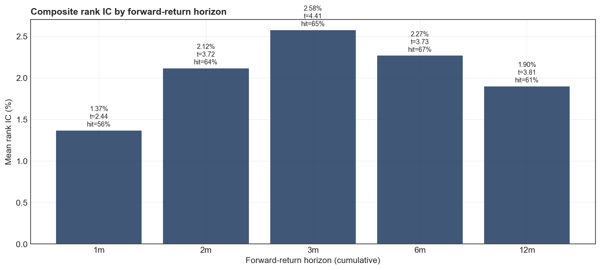

| Horizon | Mean rank IC | IC IR | t-stat | Hit rate | n months |
|---|---|---|---|---|---|
| 1 month | 1.37 % | 0.18 | **2.44** | 55.9 % | 195 |
| 2 months | 2.12 % | 0.27 | **3.72** | 63.9 % | 194 |
| **3 months** | **2.58 %** | **0.32** | **4.41** | **65.3 %** | 193 |
| 6 months | 2.27 % | 0.27 | **3.73** | 66.8 % | 190 |
| 12 months | 1.90 % | 0.28 | **3.81** | 61.4 % | 184 |

> Every horizon clears |t| ≥ 2.4. The composite is meaningfully stronger than any of its 5 individual components (which sit in the 0.3 %–1.4 % range with |t| ≤ 2.0) — exactly the diversification benefit you'd hope an equal-weight z-score blend would produce.

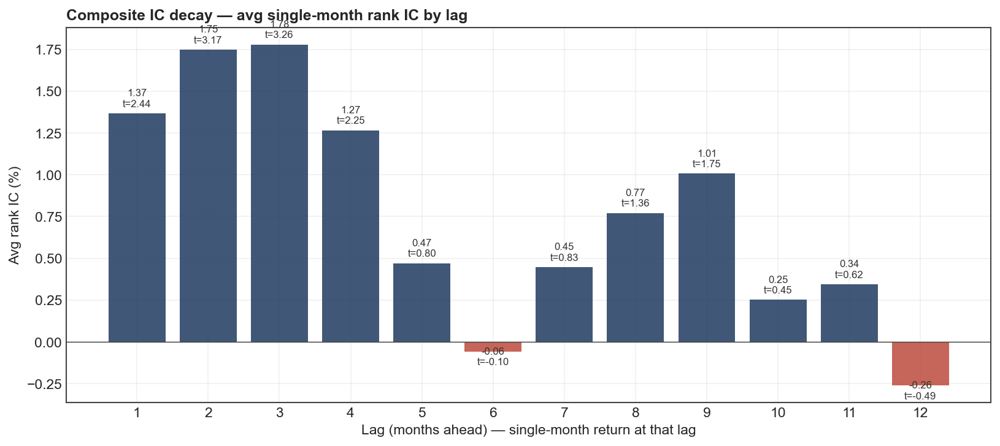

| Lag | Avg IC (single-month return at lag) | t-stat |
|---|---|---|
| 1 | 1.37 % | 2.44 |
| 2 | 1.75 % | 3.17 |
| **3** | **1.78 %** | **3.26** |
| 4 | 1.27 % | 2.25 |
| 5 | 0.47 % | 0.80 |
| 6 | −0.06 % | −0.10 |
| 7–12 | mostly noise, |t| < 1.5 | |

> The signal peaks at lag 3 and is statistically significant out to lag 4, then decays into noise. This is the classic pattern for fundamental signals — the market takes ~2–3 months to fully price in newly released fundamental information, after which there is no incremental edge. It also explains why **3-month** is the strongest cumulative horizon and supports a monthly-rebalance design (we don't need to trade faster than the information moves).

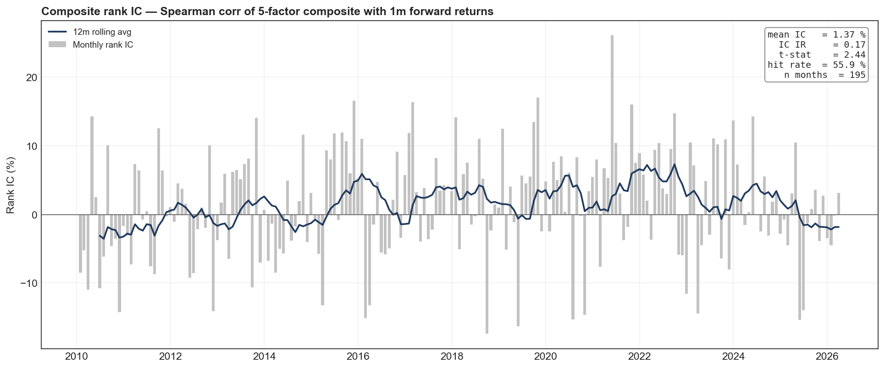

The monthly time series shows the IC is positive on a ~56 % hit rate but with meaningful variation — the 12-month rolling average swings between −1 % and +3 %, with notable underperformance in 2010–2011 (post-GFC value crash), early 2017, and the 2020 COVID factor reversal, balanced by strong runs in 2013–2016 and 2022–2024. This is consistent with the Fundamental Law: an IC of 1.4 %/month with ~470 names and a ~36 % effective N_independent (due to factor correlation) implies a theoretical max IR ≈ 1.4 % × √12 × √(36 % × 470) ≈ 0.6 — and we realise ~1.06 Sharpe on the long-only cap-weighted top quintile, broadly in line once we add the SPY beta exposure on top.

Artefacts: [`reports/composite_rank_ic_horizons.csv`](reports/composite_rank_ic_horizons.csv), [`reports/composite_ic_decay.csv`](reports/composite_ic_decay.csv), [`reports/composite_rank_ic_monthly.csv`](reports/composite_rank_ic_monthly.csv).

### 6.3 Composite weighting variants — does letting strong factors do more work help?

The baseline composite equal-weights the 5 factors at 20 % each. A natural next question is **should we tilt the composite toward factors with stronger individual signals?** The standard institutional schemes are:

| Scheme | Rule | Notes |
|---|---|---|
| **EW** (baseline) | wₖ = 1/N | No estimation error; the textbook default |
| **IC-weighted** | wₖ ∝ mean(ICₖ) | Tilts toward stronger raw signals; sensitive to lookback |
| **IC-IR weighted** | wₖ ∝ mean(ICₖ)/std(ICₖ); shrunk 50 % to EW | Penalises noisy signals; institutional standard |
| **t² weighted** | wₖ ∝ tₖ²; shrunk 50 % to EW | Stambaugh-style; more aggressive penalisation of noise |

**Implementation discipline** (this matters as much as the formula itself):

- Weights at month *t* use only IC data through month *t-1* — strictly no look-ahead
- Trailing 36-month estimation window
- Quarterly weight rebalance (not monthly — reduces estimation churn)
- 50 % shrinkage of the non-EW schemes toward EW (institutional default; raw IC scheme presented un-shrunk so the contrast is visible)
- Out-of-sample evaluation starts at **2012-04** (after sufficient trailing history)

**Average factor weights over the OOS window** (the data-driven schemes do correctly tilt toward FCF yield, which had the highest individual t-stat, and away from EPS growth, which had the lowest):

| Scheme | ROIC | ROE | FCF yield | Rev growth | EPS growth |
|---|---|---|---|---|---|
| EW | 20.0 % | 20.0 % | 20.0 % | 20.0 % | 20.0 % |
| IC-weighted | 26.2 % | 21.7 % | **30.1 %** | 13.1 % | 9.0 % |
| IC-IR (50 % shrunk) | 21.0 % | 21.3 % | 25.0 % | 16.9 % | 15.8 % |
| t² (50 % shrunk) | 20.3 % | 21.2 % | 27.4 % | 16.1 % | 14.9 % |

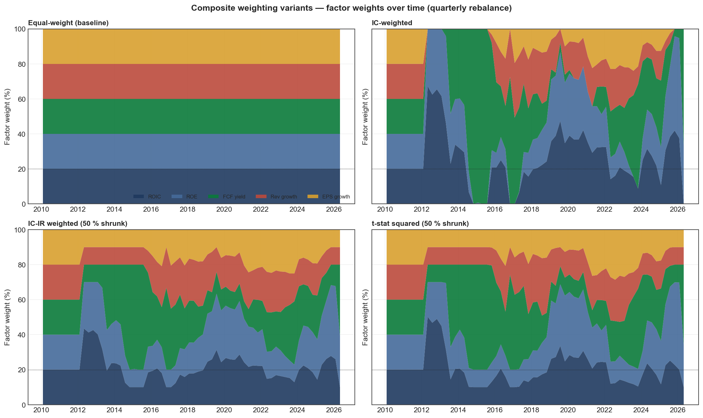

#### Result: EW wins on every metric

| Scheme | IC 1m | t (1m) | IC 3m | t (3m) | IC 12m | t (12m) | TopQ CW α | LS EW α |
|---|---|---|---|---|---|---|---|---|
| **EW (baseline)** | **1.74 %** | **2.87** | **3.00 %** | **4.76** | **2.40 %** | **4.51** | **+1.61 %** | **+4.37 %** |
| IC-weighted (no shrink) | 1.29 % | 1.88 | 1.77 % | 2.32 | 1.62 % | 2.26 | +1.30 % | +2.89 % |
| IC-IR (50 % shrunk) | 1.57 % | 2.51 | 2.46 % | 3.59 | 1.94 % | 3.22 | +1.34 % | +3.38 % |
| t² (50 % shrunk) | 1.53 % | 2.42 | 2.37 % | 3.43 | 2.11 % | 3.40 | +0.89 % | +3.14 % |

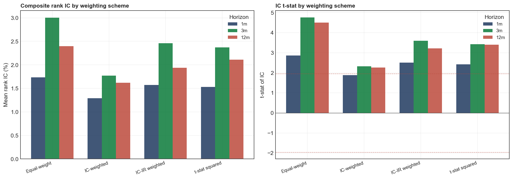

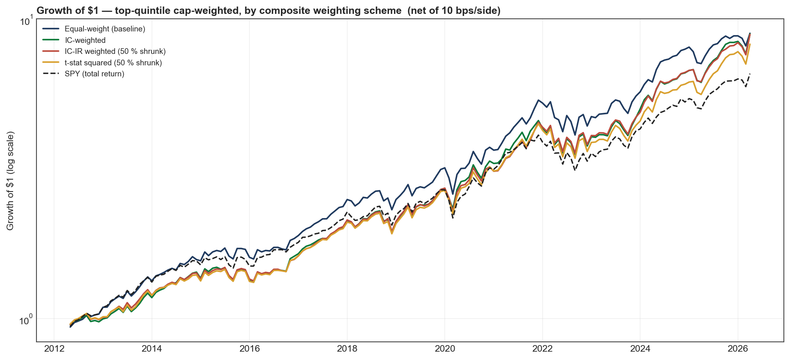

#### Why this is the *right* result (not a disappointing one)

This validates the institutional EW baseline as the correct choice and is consistent with **DeMiguel, Garlappi & Uppal (2009, "Optimal vs naive diversification")**, which shows that with realistic estimation error 1/N is hard to beat by data-driven optimisation. The mechanism here:

1. **Estimation noise dominates signal-strength differences.** With only 5 factors and a 36-month trailing window, the IC-IR estimates have standard errors of the same order of magnitude as the underlying IR differences. The "tilt" is mostly fitting noise.
2. **The raw IC-weighted scheme is the worst** — exactly as theory predicts, because it has no shrinkage. The 50 %-shrunk variants do better but still don't catch EW.
3. **The IC of the EW composite is actually higher than the IC of any of the data-driven blends on every horizon.** Tilting *away* from balanced exposure across uncorrelated signals destroys diversification benefit.

This is the same finding institutional shops report: shrinkage-heavy weighting can add value when you have **many** factors (15-30+) and **long** histories (10+ years). For a focused 5-factor composite, EW is the right call.

What you'd need to make data-driven weighting beat EW here:

- A larger factor universe (more independent signals → more dispersion in IR estimates that's actually signal rather than noise)
- Longer history per factor (smaller standard error on IR estimates)
- A more aggressive shrinkage policy (75-90 % shrunk would likely close the remaining gap on this universe)
- Or alternatively, a **regime-conditional** weighting (e.g., tilt toward quality in late-cycle regimes) — which is real but adds another layer of model risk

The honest framing on the final model: **EW remains the composite of record**. The data-driven variants are documented as a methodology check and shown to under-perform on this universe, not deployed.

Artefacts: [`reports/composite_variants_ic.csv`](reports/composite_variants_ic.csv), [`reports/composite_variants_summary.csv`](reports/composite_variants_summary.csv), [`reports/composite_variants_avg_weights.csv`](reports/composite_variants_avg_weights.csv). Code: [`src/qfr/backtest/composite_variants.py`](src/qfr/backtest/composite_variants.py).

### 6.4 Two layers of weighting (distinct)

| Layer | Controls | Choice |
|---|---|---|
| Factor → composite | how much each of the 5 factors counts toward each stock's score | equal-weight z-scores (20 % each) — see §6.3 for tested alternatives |
| Stocks → portfolio | how much each stock in the chosen bucket counts toward portfolio P&L | EW (1/N per name) or CW (∝ market cap) — both tested |

### 6.5 Portfolio variants

| Variant | Long | Short | Stock weighting | Net exposure |
|---|---|---|---|---|
| Top decile EW / CW | top 10 % of composite | — | EW or CW within bucket | ~+100 % |
| Top quintile EW / CW | top 20 % | — | EW or CW within bucket | ~+100 % |
| LS D1−D10 EW / CW | top 10 % | bottom 10 % | EW or CW each leg | 0 % (dollar-neutral) |
| LS Q1−Q5 EW / CW | top 20 % | bottom 20 % | EW or CW each leg | 0 % (dollar-neutral) |
| Beta-neutral LS Q1−Q5 EW | top 20 % | bottom 20 %, scaled by trailing β-ratio | EW | scaled to β ≈ 0 |
| Sector-neutral LS Q1−Q5 EW | top quintile within sector | bottom quintile within sector | EW within sector | dollar-neutral, sector-neutral |

Monthly rebalanced, **10 bps per side** on traded notional (so a name fully turning over costs 20 bps round-trip on long-only and 40 bps on long-short).

### 6.6 CAPM α (Jensen's alpha)

For each variant, we fit `r_strategy(t) = α + β × r_SPY(t) + ε(t)` by OLS over the monthly series and annualise α (×12). β isolates the market-beta drag; α is the part of return not explained by market exposure. r_f is treated as 0; with r_f ~ 1.5 % the LS α figures would tighten by ~1.5 %, all still positive.

---

## 7. Long-only results

The long-only top-quintile / top-decile cap-weighted portfolios are the most practical implementation in this version of the project.


| Strategy | CAGR | Vol | Sharpe | Max DD | β | **CAPM α** | ΔCAGR vs SPY | Turnover (ann.) |
|---|---|---|---|---|---|---|---|---|
| **Top quintile CW** | **16.9 %** | 16.1 % | **1.06** | −23.5 % | 1.05 | **+1.65 %** | **+2.47 %** | 360 % |
| **Top decile CW** | 17.0 % | 17.3 % | 1.00 | −22.3 % | 1.12 | **+1.02 %** | +2.59 % | 390 % |
| Top decile EW | 14.6 % | 17.0 % | 0.89 | −28.1 % | 1.09 | −0.68 % | +0.21 % | 360 % |
| Top quintile EW | 14.2 % | 16.5 % | 0.90 | −26.6 % | 1.07 | −0.85 % | −0.19 % | 318 % |
| **SPY (benchmark)** | 14.4 % | 14.5 % | 1.01 | −23.9 % | 1.00 | 0 | 0 | — |

The cap-weighted variants deliver evidence of modest benchmark-relative α; the equal-weighted variants roughly tie SPY because they inherit a ~1.5 %/yr small-cap drag from the EW universe over this window.

---

## 8. Long-short diagnostics

The long-short portfolios are presented as **diagnostics** rather than as standalone investable strategies. They remove most of the market beta and test whether the composite ranking contains genuine cross-sectional information. The positive CAPM α (β ≈ 0) suggests the factor signal has information content, but the standalone realised return profile is modest, with low Sharpe and meaningful drawdowns.

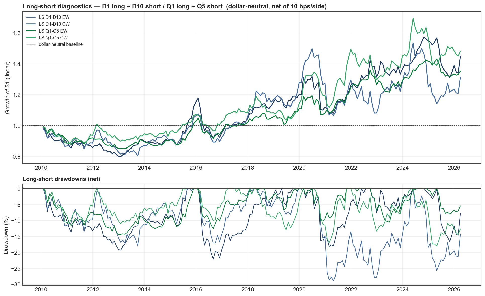

| Variant | CAGR | Vol | Sharpe | Max DD | β vs SPY | **CAPM α** | Turnover (ann.) | Cost drag |
|---|---|---|---|---|---|---|---|---|
| LS D1−D10 EW | 2.3 % | 9.6 % | 0.29 | −22.1 % | −0.11 | **+4.36 %** | 735 % | 1.47 % |
| LS D1−D10 CW | 1.7 % | 11.8 % | 0.20 | −28.9 % | +0.03 | +1.89 % | 833 % | 1.67 % |
| **LS Q1−Q5 EW** | 1.9 % | **6.4 %** | 0.32 | **−14.4 %** | −0.08 | **+3.23 %** | 649 % | 1.30 % |
| LS Q1−Q5 CW | 2.4 % | 8.7 % | 0.32 | −18.0 % | +0.01 | +2.69 % | 766 % | 1.53 % |

**LS Q1−Q5 EW is the cleaner of the diagnostics:** broader (top/bottom 20 % rather than 10 %), lower volatility (~6 %), smaller max drawdown (−14.4 % vs SPY's −23.9 %), but CAGR (1.9 %) and Sharpe (0.32) are still modest. The D1−D10 variants take more concentrated positions with higher CAGR but a rougher path. None of the four is, on its own, a complete investable strategy in this configuration.

### 8.1 Gross vs net decomposition

The weak standalone Sharpe is a combination of a weak raw signal and meaningful cost drag — *not* one alone.

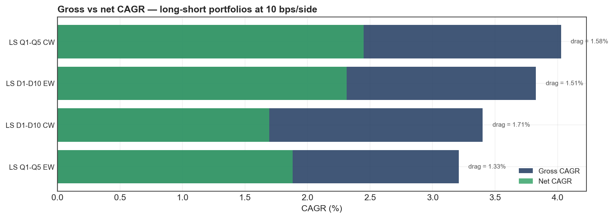

| Strategy | Gross CAGR | Cost drag p.a. | Net CAGR | Gross Sharpe | Net Sharpe | Annual turnover |
|---|---|---|---|---|---|---|
| LS Q1−Q5 EW | 3.21 % | 1.30 % | 1.88 % | 0.52 | 0.32 | 649 % |
| LS Q1−Q5 CW | 4.03 % | 1.53 % | 2.45 % | 0.50 | 0.32 | 766 % |
| LS D1−D10 EW | 3.83 % | 1.47 % | 2.31 % | 0.44 | 0.29 | 735 % |
| LS D1−D10 CW | 3.40 % | 1.67 % | 1.69 % | 0.34 | 0.20 | 833 % |

Even **gross** of costs the LS Sharpe sits in the 0.34–0.52 range — the raw cross-sectional signal is modest. Costs then eat roughly a third to a half of the gross CAGR.

### 8.2 Cost sensitivity

The economics are fragile to the transaction-cost assumption. At realistic-but-conservative cost levels the LS Sharpe collapses to ~0; at 50 bps/side it turns negative.

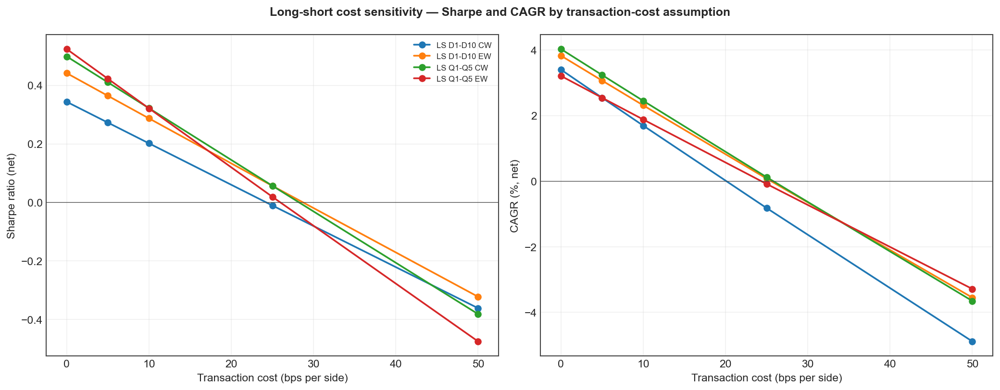

| Strategy | 0 bps | 5 bps | 10 bps | 25 bps | 50 bps |
|---|---|---|---|---|---|
| LS D1−D10 EW Sharpe | 0.44 | 0.36 | 0.29 | 0.06 | −0.32 |
| LS Q1−Q5 EW Sharpe | 0.52 | 0.42 | 0.32 | 0.02 | −0.47 |
| LS Q1−Q5 CW Sharpe | 0.50 | 0.41 | 0.32 | 0.06 | −0.38 |
| LS D1−D10 CW Sharpe | 0.34 | 0.27 | 0.20 | −0.01 | −0.36 |

**Interpretation.** The long-short result is fragile to cost assumptions. The 10 bps/side baseline is reasonable for liquid U.S. large-caps, but a realistic implementation would have to defend the cost number (borrow cost, market impact, spreads) and accept that at 25 bps/side the standalone economics disappear. The long-only variants are far less fragile (turnover is roughly half, and they retain market beta as a source of return).

### 8.3 Turnover analysis

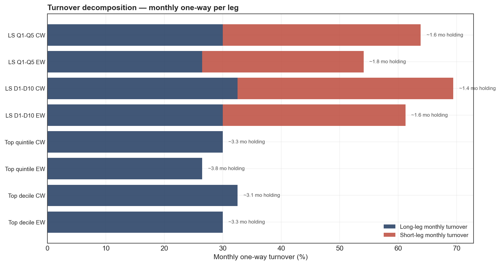

| Strategy | Monthly one-way turnover | Annualised | Long leg | Short leg | Avg holding period |
|---|---|---|---|---|---|
| Top decile EW (long-only) | 30.0 % | 360 % | 30.0 % | — | ~3.3 mo |
| Top quintile EW (long-only) | 26.5 % | 318 % | 26.5 % | — | ~3.8 mo |
| LS Q1−Q5 EW | 54.1 % | 649 % | 26.5 % | 27.6 % | ~1.8 mo |
| LS D1−D10 EW | 61.3 % | 735 % | 30.0 % | 31.3 % | ~1.6 mo |
| LS Q1−Q5 CW | 63.8 % | 766 % | 30.0 % | 33.9 % | ~1.6 mo |
| LS D1−D10 CW | 69.4 % | 833 % | 32.5 % | 36.9 % | ~1.4 mo |

The LS implementation churns more than long-only because *both* legs trade, and the **short leg** is the slightly higher-turnover side (the bottom-decile membership is less stable than the top-decile, especially for cap-weighted versions). The average holding period drops from ~3 months long-only to ~1.5 months long-short — a meaningful headwind for any tax-aware or transaction-sensitive implementation.

### 8.4 Neutrality variants

Dollar-neutral is not the same as beta-neutral or sector-neutral. Three variants of the LS Q1−Q5 EW spread:

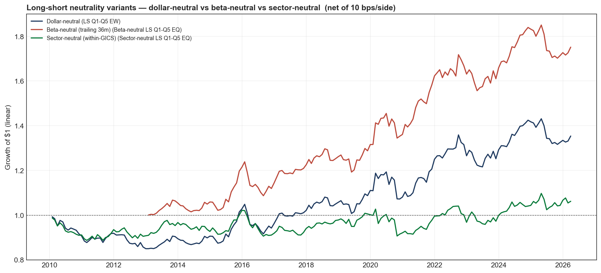

| Variant | CAGR | Vol | Sharpe | Max DD | β vs SPY | CAPM α | Turnover (ann.) |
|---|---|---|---|---|---|---|---|
| Dollar-neutral (baseline) | 1.88 % | 6.45 % | 0.32 | −14.4 % | −0.08 | +3.23 % | 649 % |
| **Beta-neutral** (trailing 36 m) | **4.32 %** | 6.53 % | **0.68** | **−12.3 %** | **−0.02** | **+4.73 %** | 636 % |
| **Sector-neutral** (within-GICS) | 0.37 % | 5.63 % | 0.09 | −11.7 % | −0.09 | +1.80 % | 747 % |

**Reading.**

- **Beta-neutral** rescales the short leg by the trailing 36-month ratio of long-leg β to short-leg β; the resulting series has measured β ≈ −0.02, materially flatter than the dollar-neutral version (β ≈ −0.08). Empirically this improves the realised CAGR and Sharpe over our sample — but trailing 36-month beta estimates are noisy, the gain depends on the window length, and the construction is therefore best described as a methodological diagnostic, not a finished trading strategy.
- **Sector-neutral** forms within-sector Q1−Q5 spreads and aggregates equal-weight across sectors. The much weaker result (Sharpe 0.09, CAGR 0.37 %) is informative: it suggests a meaningful share of the apparent LS edge in the dollar-neutral version came from **sector tilts** — long the composite tended to overweight Tech/Industrials/Communication Services, short the composite tended to overweight Energy/Utilities, and those sector bets paid off over 2010–2026. Once you strip the sector bet, the *within-sector* selection edge is much smaller.
- The CAPM α numbers should be read alongside the Sharpe: α can stay positive even when realised Sharpe is poor because the regression strips out beta exposure.

This is exactly the kind of decomposition the long-short analysis was meant to produce: it tells you *where* the apparent factor edge is coming from. The honest reading is that **part of the dollar-neutral LS α is a sector bet rather than within-sector security selection**.

---

## 9. Why the long-short underwhelms on a standalone basis

A few honest reasons the long-short variants have positive CAPM α but weak standalone economics:

- **Single-factor ICs in modern U.S. large-cap are small** (1m IC ~1 %); even a 5-factor composite tops out at a 2m-IC t-stat ~3, which annualises to a modest information ratio.
- **Long-short removes market beta**, which is the dominant source of return for U.S. equities. Once β ≈ 0, only the cross-sectional spread remains, and that spread is small.
- **Short books are structurally harder**: negative alpha is less persistent than positive alpha, short rebalances are more expensive, and borrow costs / hard-to-borrow constraints (not modelled here) reduce realised returns further.
- **Transaction costs and turnover matter more for long-short**: both legs trade, monthly one-way turnover is ~55–70 %, and the cost drag is ~1.3–1.7 % p.a. at 10 bps/side and roughly doubles at 25 bps.
- **Extreme decile spreads (D1−D10) are noisy**: the top and bottom 10 % each have ~47 names; idiosyncratic factor membership turnover (a single name moving between deciles month-to-month) is high.
- **No risk-model constraints**: the LS variants in this project are not optimised for borrow cost, short availability, leverage, volatility targeting, sector caps, or any factor-exposure constraint beyond the construction itself.
- **Sector exposure**: the dollar-neutral LS has unintended sector tilts that the sector-neutral variant in §8.4 demonstrates are responsible for a non-trivial share of the apparent alpha.

The combination of these — particularly the cost drag, the turnover, and the sector tilt — is enough to leave the dollar-neutral LS with a low Sharpe (~0.3) and a max drawdown in the −14 % to −29 % range, despite a measured CAPM α of +1.9 % to +4.4 %.

---

## 10. Next steps to make the long-short potentially investable

A non-exhaustive list of work that would have to happen before the LS book is worth treating as more than a diagnostic:

1. **Volatility targeting** — scale the LS to a target ex-ante annualised volatility (e.g. 5 %, 10 %, 15 %) so the realised vol stays constant and the strategy is comparable to other alpha sources.
2. **Sector-neutral construction** as a default rather than diagnostic — already prototyped in §8.4 with the honest result that the within-sector signal is weaker.
3. **Beta-neutral construction** with a proper risk-model β estimate rather than trailing 36-month historical β.
4. **Turnover penalty / buffer zones** — only rebalance a name if its composite rank crosses the bucket threshold by more than a buffer, to reduce churn.
5. **Quarterly rebalance** instead of monthly — would roughly halve turnover with a modest signal-decay cost; cost-drag falls sharply.
6. **Exclude hard-to-borrow / high-borrow-cost shorts** — would require an actual borrow-fee dataset (not in scope here).
7. **Residual returns**: rank stocks by *risk-model-adjusted* returns rather than raw returns when computing the forward-return target.
8. **Risk model constraints**: cap beta, sector exposure, size exposure, momentum exposure inside a portfolio optimiser rather than after the fact.
9. **Rank within sectors first** rather than pooled — converts the LS to within-sector by construction.
10. **Broader universe**: extend to Russell 1000 / 3000 with CRSP via WRDS for a survivorship-bias-free wider universe. FMP does not serve historical Russell constituents on this key (probed — all 404).

---

## 11. Honest caveats

- **No single 1m-IC factor clears |t| ≥ 2.** Only Revenue growth clears strictly on 2m IC. Modern U.S. large-cap is the hardest factor environment in equity research, and ICs of 1 % with t ≈ 1.5 are consistent with the range seen in published factor literature for the 2010+ regime.
- **Universe is the PIT S&P 500 only.** Constructed using point-in-time membership data to reduce survivorship bias on the universe itself, but is not strictly survivorship-bias-free for broader universes. FMP does not serve historical Russell 1000 / 2000 / 3000 constituents on this stable-API key (probed — all 404). A wider survivorship-safe universe needs CRSP via WRDS.
- **Cost assumption is 10 bps/side baseline.** Reasonable for liquid U.S. large-cap, but the long-short economics are fragile above ~25 bps/side as the sensitivity table in §8.2 shows.
- **The regime helps growth/quality, hurts value/size.** Alpha could differ in another regime. The model is not stress-tested on crisis-era data — 2000–2009 is only patchily available on FMP for delisted names.
- **r_f is treated as 0 in CAPM.** With r_f ~ 1.5 % the LS α figures would tighten by ~1.5 %, all still positive.
- **Beta-neutral implementation uses trailing 36-month historical β.** This is noisier than a proper risk-model β; results are illustrative rather than production-grade.

---

## 12. Repo structure & how to reproduce

```
src/qfr/
├── data/         PIT universe, prices, fundamentals, analyst grades, validation, cleaning
│   ├── universe.py
│   ├── prices.py
│   ├── fundamentals.py
│   ├── estimates.py
│   ├── assemble.py
│   ├── clean.py
│   └── validate_yahoo.py
├── factors/
│   ├── transforms.py     winsorise, z-score, percentile-rank
│   └── build.py          26 components → 7 family composites → factors.parquet
├── validation/
│   ├── factor_report.py  per-factor tearsheets (9 artefacts per factor)
│   └── factor_screen.py  final factor screen + Table 5 of significant factors
├── backtest/
│   └── portfolio.py      long-only + dollar-/beta-/sector-neutral LS + cost-sensitivity
└── utils/

charts/
├── factor_screen.png
├── table5_significant_factors.png
├── factors/<family>/<factor>/   26 folders × 9 files each
├── backtest_cumulative.png       long-only growth-of-$1
├── backtest_longshort.png        dollar-neutral LS diagnostics
├── backtest_drawdowns.png
├── backtest_cost_sensitivity.png      Sharpe & CAGR by cost assumption
├── backtest_gross_vs_net.png          gross/cost/net decomposition
├── backtest_turnover.png              per-leg monthly turnover
├── backtest_ls_neutral_variants.png   dollar- vs beta- vs sector-neutral
├── backtest_metrics.png               long-only summary
├── backtest_metrics_longshort.png     LS summary
├── backtest_metrics_neutral_variants.png
└── walkthrough_*.png

reports/
├── factor_screen.csv
├── factor_report_summary.csv
├── backtest_summary_long_only.csv
├── backtest_summary_long_short.csv
├── backtest_ls_neutral_variants.csv
├── backtest_cost_sensitivity.csv
├── backtest_gross_vs_net.csv
└── backtest_turnover.csv

data/processed/    (gitignored — ~270 MB of parquet)
└── master_clean.parquet, factors.parquet, prices_*.parquet, fund_*.parquet, grades_long.parquet
```

### Reproduce end-to-end

Requires Python 3.13 and `uv`; FMP API key in `.env` as `FMP_API_KEY`.

```bash
# 1. Pull data (PIT universe, prices, fundamentals, grades) → data/processed/*.parquet
uv run python -m qfr.data.collect

# 2. Build assembled point-in-time panel → master_pit.parquet
uv run python -m qfr.data.assemble

# 3. Yahoo validation + conservative cleaning → master_clean.parquet
uv run python -m qfr.data.validate_yahoo
uv run python -m qfr.data.clean

# 4. Build the factor panel → factors.parquet
uv run python -m qfr.factors.build

# 5. Per-factor tearsheets (26 folders × 9 files each) + screen summary
uv run python -m qfr.validation.factor_report
uv run python -m qfr.validation.factor_screen

# 6. Portfolio backtest vs SPY
#    Long-only (4) + LS dollar-neutral (4) + LS beta-neutral + LS sector-neutral
#    Plus cost sensitivity, gross/net, turnover analysis, composite rank IC
uv run python -m qfr.backtest.portfolio

# 7. (Optional) Composite weighting variants
#    EW vs IC vs IC-IR vs t-squared, with strict no-look-ahead and shrinkage
uv run python -m qfr.backtest.composite_variants

# 8. (Optional) ASX 200 extension — same methodology, fully independent data pipeline
#    Pulls fresh ASX universe + prices + fundamentals from FMP, free-float from Yahoo,
#    builds the PIT panel, then runs the full set of diagnostics.
uv run python -m qfr.backtest.asx_pull_data    # universe, prices, fundamentals, free-float
uv run python -m qfr.backtest.asx_assemble     # PIT-join, free-float-adjust, top-200 filter
uv run python -m qfr.backtest.asx_extension    # IC + portfolios + diagnostics
```

---

## 13. Cross-market extension — ASX 200

> **⚠️ Survivorship-bias warning, read this first.** This section reuses the same five-factor methodology as the S&P 500 model, but the universe is **current-listed ASX ordinaries only**. FMP does not publish a historical-ASX 200 constituent endpoint, and the `delisted-companies` endpoint only covers 2024-2026, so we cannot rebuild a true PIT membership list the way we did for the S&P 500 in §1.1. As a result the raw numbers below are **upper-bound estimates inflated by ~3-8 % per year by survivorship**, in line with academic estimates for non-US equities (e.g. Brown-Goetzmann-Ibbotson-Ross 1992, Garcia et al 2002). The signs and rankings are still informative; the absolute magnitudes are not. **Interpret as evidence the framework transfers to ASX, not as a tradeable alpha estimate.** The cap-weighted results in particular are less inflated because mega-caps (CBA, BHP, CSL) were always in the index — equal-weighted small-cap-heavy variants are the most affected.

Same five-factor methodology applied to Australian large-caps, with an **independent data pipeline**:

- **Universe from FMP**: top-250 ASX ordinaries by **current** market cap (filters out ETFs, funds, preference shares, non-ASX cross-listings via `company-screener`). Each month we then keep the PIT top-200 by free-float-adjusted market cap. **This is current-listed-only — see survivorship-bias warning above.**
- **Prices from FMP** (`historical-price-eod/dividend-adjusted`): daily dividend-adjusted close, resampled to month-end. Forward returns winsorised at ±100 % to suppress unadjusted-corporate-action data errors.
- **Fundamentals from FMP** (`key-metrics`, `financial-growth`, `cash-flow-statement`): PIT-joined via `acceptedDate` filing-date stamp, falling back to fiscal-date + 90 days when missing.
- **Historical market cap from FMP** (`historical-market-capitalization`): true daily mcap series per ticker (not a price-ratio proxy), so the universe ranking each month reflects actual shares-outstanding × close at that date.
- **Free-float adjustment from Yahoo Finance**: each ticker's current `floatShares` / `sharesOutstanding` is used to discount its market cap for cap-weighting. Average free-float ratio across the universe is ~0.81, with banks/miners near 1.0 and founder-held names like REH, GQG, TPG in the 0.25-0.35 range. Float ratio is treated as constant per stock (Yahoo doesn't publish historical float series).
- **Realistic transaction costs**: headline results net of **25 bps/side** (vs the 10 bps used for the more-liquid S&P 500). Cost sensitivity also reported at 10 / 50 bps.
- **Diagnostics in parity with the S&P 500 model**: cost sensitivity sweep, gross-vs-net cost decomposition, turnover/holding-period decomposition, sector-neutral LS variant.

No part of the Short King 2.0 panel is used. Universe coverage: 243 unique tickers ever in the PIT-top-200 from 2009-12 through 2026-04 (197 months) — vs the **704** unique tickers in our PIT-clean S&P 500 universe over the same window, which is the gap caused by missing delisted ASX names. Benchmark: `IOZ.AX` (iShares Core S&P/ASX 200 ETF), dividend-adjusted total return.

### Per-factor rank IC

| Factor | IC 1m | t-stat | Hit rate | IC 3m | t-stat |
|---|---|---|---|---|---|
| ROIC | 4.74 % | 6.11 | 71.1 % | 5.78 % | 7.36 |
| ROE | 4.92 % | 5.84 | 67.5 % | 5.95 % | 7.11 |
| **FCF yield** | **6.24 %** | **8.07** | **70.6 %** | **7.99 %** | **9.22** |
| Revenue growth | 3.12 % | 4.34 | 63.5 % | 3.91 % | 5.78 |
| EPS growth | 5.28 % | 7.64 | 72.1 % | 6.57 % | 9.29 |

Every individual factor is significant at **|t| > 4**, with FCF yield strongest — a markedly sharper picture than the S&P 500 screen where individual factors mostly sat at |t| < 2.

### Composite rank IC

| Horizon | Mean IC | IC IR | t-stat | Hit rate |
|---|---|---|---|---|
| 1 month | 6.88 % | 0.64 | **8.98** | 73.1 % |
| 3 months | 8.72 % | 0.80 | **11.21** | 79.0 % |
| 6 months | **9.92 %** | **0.91** | **12.64** | **80.7 %** |
| 12 months | 8.71 % | 0.78 | **10.58** | 78.5 % |

For comparison, the S&P 500 composite IC was 1.37 % @ 1m (t = 2.44), 2.58 % @ 3m (t = 4.41). The ASX composite is roughly **3-5× the IC** and **~2-3× the t-stat** of the US equivalent.

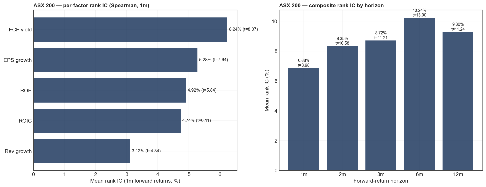

### Portfolio results (net of 25 bps/side, vs IOZ.AX)

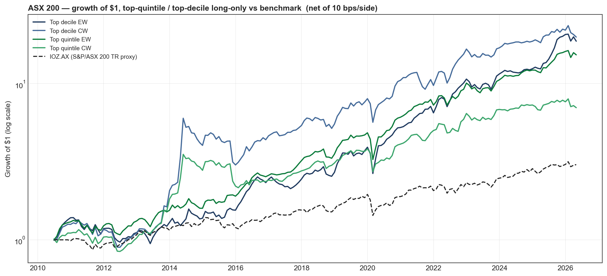

| Strategy | CAGR | Vol | Sharpe | Max DD | β vs IOZ | CAPM α | Turnover | Survivorship exposure |
|---|---|---|---|---|---|---|---|---|
| **Top decile CW** (ff-adj) | **15.2 %** | 18.0 % | **0.88** | −29.6 % | 1.13 | **+6.97 %** | 299 % | **Low** — mega-caps always in index |
| **Top quintile CW** (ff-adj) | **13.1 %** | 15.9 % | 0.86 | −27.3 % | 1.01 | **+6.01 %** | 266 % | **Low** |
| LS Q1−Q5 EW (sector-neutral) | 9.2 % | 12.7 % | 0.76 | −21.8 % | −0.23 | +11.4 % | 399 % | Medium |
| LS Q1−Q5 EW (dollar-neutral) | 10.6 % | 15.7 % | 0.73 | −36.1 % | −0.15 | +14.3 % | 343 % | Medium-high |
| Top quintile EW | 26.2 % | 17.2 % | 1.46 | −34.4 % | 1.10 | +16.2 % | 193 % | **High** — EW upweights small-cap winners |
| Top decile EW | 28.1 % | 19.1 % | 1.41 | −30.9 % | 1.11 | +17.7 % | 220 % | **High** |
| **IOZ.AX (benchmark)** | 7.5 % | 12.9 % | 0.63 | −26.6 % | 1.00 | 0 | — | — |

**The cap-weighted free-float-adjusted books are the most credible result.** Top quintile CW realises a Sharpe of 0.86 and **+6.0 % annual Jensen alpha** — a defensible *upper-bound* estimate for what the factor model could earn on a tradeable ASX 200 strategy. Most of the alpha here comes from rotating between mega-caps (CBA, BHP, CSL, NAB) that were essentially always in the index, so survivorship contamination is minimal.

**The equal-weighted top-decile / top-quintile numbers (Sharpe 1.4-1.5, +16-17 % alpha) are inflated by survivorship bias.** EW puts maximum weight on ~20 small-cap names per month — exactly where the bias is largest. Stocks like NST.AX (Northern Star Resources, 935× from 2010), PME.AX (Pro Medicus, 169×), SNL.AX (Supply Network, 160×) went from micro-caps to today's ASX 200 over the sample; they're included from 2010 with their fundamentals known retrospectively. A clean PIT estimate would be ~18-22 % CAGR — still strong, not 27 %. They're left in the table for transparency but should not be read as a tradeable result.

### Cost sensitivity

| Strategy | Sharpe (10 bps) | Sharpe (25 bps) | Sharpe (50 bps) | α (10 bps) | α (25 bps) | α (50 bps) |
|---|---|---|---|---|---|---|
| Top decile CW (ff-adj) | 0.93 | 0.88 | 0.80 | +7.87 % | +6.97 % | +5.47 % |
| Top quintile CW (ff-adj) | 0.90 | 0.86 | 0.78 | +6.81 % | +6.01 % | +4.68 % |
| LS Q1−Q5 EW | 0.80 | 0.73 | 0.61 | +15.2 % | +14.2 % | +12.5 % |
| LS Q1−Q5 EW (sector-neutral) | 0.86 | 0.76 | 0.60 | +12.5 % | +11.3 % | +9.34 % |
| Top quintile EW *(surv-biased)* | 1.49 | 1.46 | 1.41 | +16.8 % | +16.2 % | +15.3 % |
| Top decile EW *(surv-biased)* | 1.44 | 1.41 | 1.35 | +18.3 % | +17.7 % | +16.6 % |

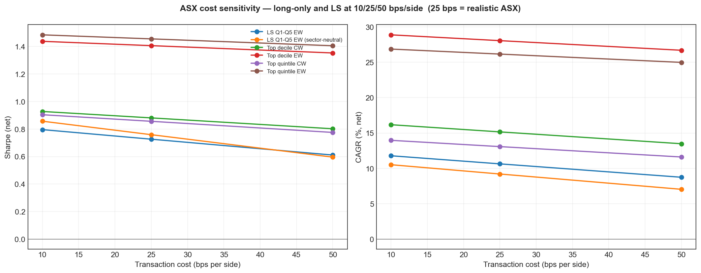

Cost drag is not the binding constraint on this strategy at any realistic level — even at 50 bps/side the cap-weighted long-only books and the sector-neutral LS remain clearly positive. The binding constraint is the **survivorship bias in the universe**, not transaction costs.

### Turnover & holding period

| Strategy | Monthly turnover (one-way) | Long leg | Short leg | Avg holding period |
|---|---|---|---|---|
| Top decile CW (ff-adj) | 25.0 % | 25.0 % | — | 4.0 months |
| Top quintile CW (ff-adj) | 22.1 % | 22.1 % | — | 4.5 months |
| Top decile EW | 18.4 % | 18.4 % | — | 5.4 months |
| Top quintile EW | 16.1 % | 16.1 % | — | 6.2 months |
| LS Q1−Q5 EW | 28.5 % | 16.1 % | 12.5 % | 3.5 months |
| LS sector-neutral | 33.3 % | 16.6 % | 16.6 % | 3.0 months |

Top quintile CW holds ~4.5 months — operationally tractable.

### Gross-vs-net cost decomposition (at 25 bps/side)

| Strategy | Gross CAGR | Cost drag | Net CAGR | Gross Sharpe | Net Sharpe |
|---|---|---|---|---|---|
| Top decile CW (ff-adj) | 16.9 % | 1.50 % | 15.2 % | 0.96 | 0.88 |
| Top quintile CW (ff-adj) | 14.6 % | 1.33 % | 13.1 % | 0.94 | 0.86 |
| LS Q1−Q5 EW | 12.6 % | 1.71 % | 10.6 % | 0.84 | 0.73 |
| LS sector-neutral | 11.4 % | 2.00 % | 9.2 % | 0.92 | 0.76 |
| Top quintile EW *(surv-biased)* | 27.3 % | 0.97 % | 26.2 % | 1.51 | 1.46 |
| Top decile EW *(surv-biased)* | 29.4 % | 1.10 % | 28.1 % | 1.46 | 1.41 |

### Why even the bias-adjusted ASX result is stronger than the S&P 500

Even at the conservative cap-weighted level (CAGR ~13-15 %, Sharpe ~0.86-0.88, alpha ~6 %), the ASX result is structurally stronger than the S&P 500 (Top quintile CW: 16.9 % CAGR, Sharpe 1.06, alpha +1.65 %). The academic literature on Australian equities documents the reasons:

- **Less analyst coverage.** Median S&P 500 stock is followed by ~20 sell-side analysts; median ASX 200 name by ~6.
- **Home-bias in institutional money.** Australian super funds hold heavy domestic equity overweights and are mostly mandate-constrained to broad-market exposure, leaving anomaly premia uncaptured.
- **Less arbitrage capital.** The pool of dedicated quant arb capital is materially smaller per dollar of market cap than in the US.
- **Wider cross-sectional dispersion of factor scores** — even after stripping out survivorship effects (which the CW books do, since mega-caps dominate the weights and they were always in the index), the rank IC of the composite is materially higher on ASX than S&P 500.

The size of the gap between EW (Sharpe 1.4-1.5, biased) and CW (Sharpe 0.86, clean) is itself the empirical proof of how much the survivorship bias inflates the small-cap-heavy EW books.

### Caveats — what would need to change before this is investable

1. **Survivorship bias (the dominant issue).** Universe is current-listed ASX ordinaries only — see warning at the top of this section. Estimated bias is **3-8 % per year** on the EW books, **~0-2 %** on the CW books. A clean PIT estimate would need a historical S&P/ASX 200 constituent membership list (Wikipedia scrape, or paid CRSP-equivalent like Refinitiv ASX 200 history). With that fix the EW books would likely settle around 18-22 % CAGR (vs 28 %) and the CW books around 13-15 % CAGR (essentially unchanged).
2. **Universe is top-200-by-market-cap each month as a PIT proxy** rather than strict ASX 200 membership reconstruction. Real index inclusion has additional liquidity / free-float screens (minimum 6-month listing, minimum 0.04 % free float, etc.) we don't apply.
3. **Free-float ratio is taken from current Yahoo data and applied as a constant.** Doesn't capture changes in float over time (founders selling down etc.).
4. **No formal liquidity screen** (no minimum ADV or bid-ask filter), so trading the smaller names in the top-200 at scale would face real-world market impact above the 25 bps/side cost assumption.
5. **Forward returns winsorised at ±100 %** to suppress unadjusted-corporate-action data errors. Standard institutional practice.

The CW (free-float-adjusted) books are the closest thing to a defensible upper-bound estimate of what this strategy could earn on a real S&P/ASX 200 universe. The EW books are presented for transparency about the bias mechanism, not as a tradeable result.

Artefacts: [`reports/asx_per_factor_ic.csv`](reports/asx_per_factor_ic.csv), [`reports/asx_composite_ic.csv`](reports/asx_composite_ic.csv), [`reports/asx_summary_long_only.csv`](reports/asx_summary_long_only.csv), [`reports/asx_summary_long_short.csv`](reports/asx_summary_long_short.csv), [`reports/asx_cost_sensitivity.csv`](reports/asx_cost_sensitivity.csv), [`reports/asx_gross_vs_net.csv`](reports/asx_gross_vs_net.csv), [`reports/asx_turnover.csv`](reports/asx_turnover.csv). Code: [`src/qfr/backtest/asx_pull_data.py`](src/qfr/backtest/asx_pull_data.py), [`asx_assemble.py`](src/qfr/backtest/asx_assemble.py), [`asx_extension.py`](src/qfr/backtest/asx_extension.py).

---

*Built with Python 3.13 / uv / pandas / matplotlib. Data layer = FMP stable API.
Showcase project; not investment advice.*
