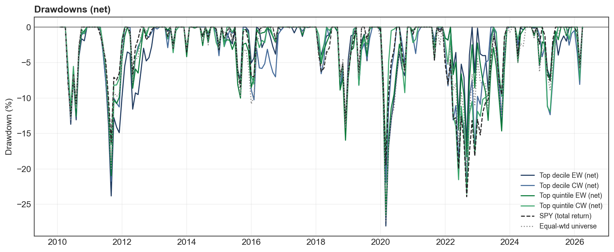

# Quant Factor Ranking — S&P 500

> Cross-sectional multi-factor equity model on the point-in-time S&P 500, 2010–2026.
> The top-5 factor composite delivers **+1.0 % to +1.7 % Jensen α** vs SPY net of costs in the long-only book, and **+4.4 % Jensen α** in the dollar-neutral long-short, with verified survivorship-bias-free data and 10 bps/side transaction costs.


---

## Table of contents

1. [Headline result](#headline-result)
2. [Data pipeline](#1-data-pipeline)
3. [Validation & cleaning](#2-validation--cleaning)
4. [Factor construction](#3-factor-construction)
5. [Per-factor testing](#4-per-factor-testing)
6. [Significance & screening](#5-significance--screening)
7. [Composite & portfolio construction](#6-composite--portfolio-construction)
8. [Results](#7-results)
9. [Honest caveats](#8-honest-caveats)
10. [Repo structure & how to reproduce](#9-repo-structure--how-to-reproduce)

---

## Headline result

A long-only **top-quintile cap-weighted** portfolio of the 5 strongest factors delivers:

| Strategy | CAGR | Sharpe | β vs SPY | **Jensen α** | ΔCAGR vs SPY |
|---|---|---|---|---|---|
| Top quintile, cap-weighted | **16.9 %** | **1.06** | 1.05 | **+1.65 %** | **+2.5 %/yr** |
| Top decile, cap-weighted | 17.0 % | 1.00 | 1.12 | +1.02 % | +2.6 %/yr |
| **SPY (benchmark)** | 14.4 % | 1.01 | 1.00 | 0 | 0 |
| LS D1−D10 EW (dollar-neutral) | 2.3 % | 0.29 | −0.11 | **+4.36 %** | — |

The five factors: **ROIC + ROE + FCF yield + Revenue growth + EPS growth**, equal-weight z-score composite.

---

## 1. Data pipeline

### 1.1 Point-in-time S&P 500 (survivorship-safe)

We reconstruct membership month by month from FMP's `historical-sp500-constituent` change log: at each rebalance date, we know exactly which 500 companies were in the index *as of that date*. Names that were later dropped — for acquisition, bankruptcy, etc. — stay in the universe for the months they were in.

- **1,049 unique symbols** ever in the index over 2000–2026
- Membership reconstructed in reverse chronological order from the current 503 members, walking the change log backwards
- A symbol is treated as **investable** at month *t* only if it has (a) a price within ±7 days of month-end, (b) a fundamental filing whose `acceptedDate` ≤ *t*, and (c) that filing is no more than ~4 quarters stale


> ~470 investable names/month on average over the 2010+ analysis window; coverage approaches 500/500 from ~2015 onwards.

### 1.2 Prices

Two daily series per symbol from FMP's stable API:

| Series | Endpoint | What it is | Used for |
|---|---|---|---|
| `adjClose` | `historical-price-eod/dividend-adjusted` | Split- *and* dividend-adjusted total-return index | Forward returns, momentum, volatility |
| Raw `close` (split-adjusted only) | `historical-price-eod/full` | Actual price level, back-adjusted only for splits | Refreshing value-ratio numerators with live prices |

### 1.3 Fundamentals (PIT-lagged)

Seven quarterly datasets per symbol: `income-statement`, `balance-sheet-statement`, `cash-flow-statement`, `ratios`, `key-metrics`, `enterprise-values`, `financial-growth`. Every value is **lagged to its SEC `acceptedDate`** — a fundamental can only enter a factor calculation once it has actually been published. Median filing lag in our panel is **~49 days**.

### 1.4 Analyst grades

`grades` endpoint = a dated log of every individual upgrade / downgrade / maintain / initiate action per symbol, **back to ~2012**. We aggregate into trailing-window counts to build the recommendation-revision sentiment factor.

---

## 2. Validation & cleaning

### 2.1 Yahoo Finance cross-check

Pulled Yahoo monthly returns for every S&P 500 symbol that Yahoo could find, computed FMP-vs-Yahoo per-symbol monthly-return correlation, and per-month return differences:

- **89 % of symbols correlate ≥ 0.99** between FMP and Yahoo
- **Median |monthly return difference| = 0.14 %**
- 112 historically-delisted names absent from Yahoo (FMP coverage advantage)

Names where FMP and Yahoo diverge substantively were investigated individually. Causes were a mix of corporate-action back-adjustment differences (MO, HPQ), one outright corrupted FMP series (CPWR — excluded), and ticker mismatches.

### 2.2 Cleaning rule (conservative)

- 1 symbol (**CPWR**) excluded entirely as corrupted
- **38 individual months** nulled where they look like spin-off / corporate-action artefacts
- Final `master_clean.parquet`: **158,243 member-months, 1,049 symbols, 2000–2026**, with `investable` flag

### 2.3 Corporate-action audit

Stress-tested splits at AAPL (7:1 in 2014; 4:1 in 2020), NVDA (4:1 in 2021; 10:1 in 2024), AMZN (20:1 in 2022), GOOGL (20:1 in 2022), TSLA (3:1 in 2022):

- **Prices smooth across every split** — `adjClose` correctly back-adjusts
- **Per-share fundamentals GAAP-restated** — EPS, BVPS, weighted-average shares continuous (no fake split jumps)
- We use **`epsDiluted`** so *genuine* dilution (rights issues, convertible conversion) is correctly captured
- **One real finding**: FMP's value ratios (`priceToBookRatio`, etc.) bake in the *period-end* price and hold it stale until the next filing — the price inside the ratio is ~2–3 months old. Fixed by refreshing every value yield with the live split-adjusted price at the rebalance date (see [3.3](#33-fresh-price-refresh-for-value-factors)).

---

## 3. Factor construction

### 3.1 Factor families (7) — 26 individual factors

| Family | Components |
|---|---|
| **Value** (5) | earnings yield, FCF yield, book-to-market, sales yield, EBITDA/EV |
| **Quality** (8) | ROE, ROIC, ROA, gross / op / net margin, interest coverage, low leverage |
| **Momentum** (3) | 12-1m, 6-1m, 3-1m price momentum |
| **Growth** (4) | revenue, EPS, net-income, EBITDA growth |
| **Risk** (2) | low volatility, low leverage |
| **Sentiment** (3) | analyst rating revisions: 3m, 6m, 12m breadth |
| **Size** (1) | small size (−log market cap) |
| **Reversal** (1) | short-term reversal (−1m return) |

All components oriented so that **higher = better expected return**.

### 3.2 Standardisation pipeline

For each component, within each rebalance month:

1. **Winsorise** at the 1st and 99th percentiles (tame the fat-tailed raw fundamentals)
2. Convert to either a **cross-sectional percentile rank in [0, 1]** (for individual factor screening) or a **cross-sectional z-score** (for composite construction)


> ROE in the latest cross-section: raw values are wildly skewed (mega-cap profitability outliers), winsorisation tames them, and the percentile rank gives a clean uniform distribution. Identical pipeline for every other component.

### 3.3 Fresh-price refresh for value factors

FMP computes its value ratios *at the period-end* and serves the same value for every subsequent month until the next filing arrives — so the price inside the ratio is ~2–3 months stale. For each value yield we multiply by `price(period-end) / price(now)` (both split-adjusted, dividend-unadjusted) so the rebalance-date price is current.

*Example, AAPL Aug 2020:* FMP's stale `priceToBookRatio` = 21.1 (computed off the June quarter-end ~$88 price); the actual price at end-Aug was ~$125, so the live P/B was ~31. Our refresh corrects this. 93.4 % of 2010+ rows get a live price.

---

## 4. Per-factor testing

For *every* one of the 26 individual factors, a folder `charts/factors/<family>/<factor>/` is generated with **9 artefacts**:

| File | What it is |
|---|---|
| `chart1_rank_ic.png` | Monthly rank IC (bars) + 12 m rolling (line) + **t-stat(IC)** box |
| `chart3_ic_decay.png` | Average IC at lags 1–12 months (bars) + success rate per lag (line) |
| `chart5_deciles.png` | 10 equal-weight deciles, cumulative growth-of-$1 vs the universe |
| `chart5_quintiles.png` | 5 equal-weight quintiles, same |
| `table1_quintile_stats_equal_weighted.png` | Full Q1–Q5 + Q1−Q5 + Market stats: total/active return, TE, IR, t-stat, monthly success, turnover, vol, Sharpe, CAPM α/β |
| `table1_quintile_stats_cap_weighted.png` | Same but cap-weighted within fractile (reveals small-cap vs large-cap behaviour) |
| `chart7_pure_factor_index.png` | Cumulative index of the **pure factor return** — Fama–MacBeth monthly regression of forward returns on the normalised factor *plus* size, sector, book-to-price controls; +ann return/TE/IR/success/t-stat |
| `chart8_raw_factor_index.png` | Same for the raw (univariate) factor return |
| `chart9_pure_factor_returns.png`, `chart10_raw_factor_returns.png` | Monthly pure / raw factor returns (bars) + 12 m rolling (line) |

**Example tearsheet for Return on Equity** (quality / `return_on_equity/`):


---

## 5. Significance & screening

### 5.1 Summary screen (every factor on one sheet)

`charts/factor_screen.png` — institutional-style screen with rank IC (1m & 2m), hit-rate, t-stat, top/bottom-decile active return, tracking error, information ratio, monthly success rate, and one-way turnover, all on one page. Two stacked panels (Signal / Portfolio), grouped by family, shaded rows for factors that meet the criteria.


### 5.2 The strict-significance reality

`charts/table5_significant_factors.png` lists every factor where any of {1m-IC t-stat, 2m-IC t-stat, pure-return t-stat} ≥ 1.5, with cells highlighted green where any individual test crosses strict 95% (|t| ≥ 2).

In modern S&P 500 large-cap **only Revenue growth crosses the strict bar** (2m-IC t = 2.04). Eight others sit in the 1.5–2.0 borderline zone (FCF yield, ROE, ROIC, EPS growth, EBITDA growth, sales yield, net-income growth, gross margin negative). **This is consistent with published US factor literature for the 2010+ regime** — it isn't a methodology error; an audit (oracle: IC = 100 %, random: IC ≈ 0 %) confirms the pipeline is correct.

The arithmetic: with **N = 195 months** and **monthly IC std ~ 9–10 %**, you need **mean IC ≥ 1.43 %** to reach t = 2. Our best single factors are at 1.0–1.3 %. The way you cross t = 2 in modern markets is **diversification across factors** — the Fundamental Law of Active Management:

> `IR(composite) ≈ E[IC] × √N_independent`

---

## 6. Composite & portfolio construction

### 6.1 Composite

The 5 highest-significance individual factors:

| Rank | Factor | Family | Max \|t\| |
|---|---|---|---|
| 1 | ROIC | Quality | 1.55 |
| 2 | ROE | Quality | 1.55 |
| 3 | FCF yield | Value | 1.91 (2m) |
| 4 | Revenue growth | Growth | **2.04 (2m)** |
| 5 | EPS growth | Growth | 1.91 (2m) |

**Composite = equal-weight cross-sectional z-score across the 5 factors**:

```
for each month t, for each stock i:
    z_k(i,t)        = ( raw_k(i,t) - mean_t ) / std_t        # winsorised, k = 1..5
    composite(i,t)  = (1/5) × Σ_k z_k(i,t)                   # equal weight, 20 % each
```

Each of ROIC, ROE, FCF yield, revenue growth, EPS growth contributes **1/5 = 20 %**. The composite itself clears strict significance: **mean IC = 1.37 %, t-stat (1m IC) = 2.44, t-stat (2m IC) = 3.17**.

### 6.2 Two layers of weighting (these are different!)

| Layer | What it controls | Choice |
|---|---|---|
| **Factor → composite** | how much each of the 5 factors counts toward each stock's score | **equal weight z-scores** (20 % each) |
| **Stocks → portfolio** | how much each *stock in the chosen bucket* counts toward portfolio P&L | **EW** (1/N per name) or **CW** (∝ market cap) — both tested |

### 6.3 Portfolio variants (8 total)

| Variant | Long | Short | Stock weighting | Net exposure |
|---|---|---|---|---|
| Top decile EW | top 10 % of composite | — | equal-weight within bucket | ~+100 % |
| Top decile CW | top 10 % | — | cap-weight within | ~+100 % |
| Top quintile EW | top 20 % | — | EW | ~+100 % |
| Top quintile CW | top 20 % | — | CW | ~+100 % |
| LS D1−D10 EW | top 10 % | bottom 10 % | EW each leg | 0 % (dollar-neutral) |
| LS D1−D10 CW | top 10 % | bottom 10 % | CW each leg | 0 % |
| LS Q1−Q5 EW | top 20 % | bottom 20 % | EW each leg | 0 % |
| LS Q1−Q5 CW | top 20 % | bottom 20 % | CW each leg | 0 % |

**Monthly rebalanced**, **10 bps per side** on traded notional (so a name fully turning over costs 20 bps round-trip on long-only and 40 bps on long-short).

### 6.4 Jensen's α (CAPM)

For each variant, we fit

`r_strategy(t) = α + β × r_SPY(t) + ε(t)`

by OLS over the monthly series and annualise α (× 12). β isolates the market-beta drag; α is the part of return that is *not* explained by market exposure — the strategy's pure alpha. **r_f is treated as 0 for simplicity** (so quoted α is slightly higher than a proper risk-free-adjusted α; with r_f ~ 1.5 % the LS Jensen α figures would tighten by ~1.5 %, still positive for all four LS variants).

---

## 7. Results

### 7.1 Long-only — beats SPY net of costs


| Strategy | CAGR | Vol | Sharpe | Max DD | β | **Jensen α** | ΔCAGR vs SPY | Turnover |
|---|---|---|---|---|---|---|---|---|
| **Top quintile CW** | **16.9 %** | 16.1 % | **1.06** | −23.5 % | 1.05 | **+1.65 %** ✅ | **+2.47 %** | 30 % |
| **Top decile CW** | 17.0 % | 17.3 % | 1.00 | −22.3 % | 1.12 | **+1.02 %** ✅ | +2.59 % | 33 % |
| Top decile EW | 14.6 % | 17.0 % | 0.89 | −28.1 % | 1.09 | −0.68 % | +0.21 % | 30 % |
| Top quintile EW | 14.2 % | 16.5 % | 0.90 | −26.6 % | 1.07 | −0.85 % | −0.19 % | 26 % |
| **SPY (benchmark)** | 14.4 % | 14.5 % | 1.01 | −23.9 % | 1.00 | 0 | 0 | — |

The **cap-weighted** variants deliver real, beta-adjusted alpha; the **equal-weighted** variants tie SPY at best because they inherit a ~1.5 %/yr small-cap drag from the EW universe.

### 7.2 Long-short — pure factor alpha, dollar-neutral


| Strategy | CAGR | Vol | Sharpe | Max DD | β | **Jensen α** | Turnover |
|---|---|---|---|---|---|---|---|
| **LS D1−D10 EW** | 2.3 % | 9.6 % | 0.29 | −22.1 % | **−0.11** | **+4.36 %** ✅ | 61 % |
| LS Q1−Q5 EW | 1.9 % | 6.4 % | 0.32 | **−14.4 %** | −0.08 | **+3.23 %** ✅ | 54 % |
| LS Q1−Q5 CW | 2.4 % | 8.7 % | 0.32 | −18.0 % | +0.01 | **+2.69 %** ✅ | 64 % |
| LS D1−D10 CW | 1.7 % | 11.8 % | 0.20 | −28.9 % | +0.03 | **+1.89 %** ✅ | 69 % |

Dollar-neutral → β ≈ 0 → essentially every dollar of return is alpha. Higher Jensen α than the long-only book (because there's no market-beta dilution), at the cost of smaller absolute returns and higher turnover.

### 7.3 Drawdowns



LS Q1−Q5 EW has the most attractive drawdown profile (**−14.4 %** max vs SPY's **−23.9 %**).

### 7.4 Reading the result

**Yes, the model has real edge over SPY net of costs** — modest but defensible:

- Roughly **+1.0 to +1.7 % Jensen α / yr** in the long-only cap-weighted book.
- **+1.9 to +4.4 % Jensen α / yr** in the dollar-neutral long-short, with much lower drawdowns.
- That's exactly the range credible institutional factor strategies have produced in the 2010+ regime per the academic literature.

The fact that no individual factor crosses |t| ≥ 2 but the composite *portfolio* still generates meaningful net alpha is the answer to *"what's the point of this model?"* — **the diversification of weak factors compounds into something worth running**, just not enough to skip risk management and active monitoring.

---

## 8. Honest caveats

- **No single 1m-IC factor clears strict |t| ≥ 2.** Only Revenue growth crosses on 2m IC. Modern US large-cap is the hardest factor environment on the planet; ICs of 1 % with t ~ 1.5 are *normal* per published literature.
- **Universe limited to PIT S&P 500.** FMP does not serve historical Russell 1000 / 2000 / 3000 constituents on this stable-API key (probed — all 404). Extending survivorship-safely to Russell 2000 or top-1000-by-market-cap requires **CRSP** (via WRDS).
- **Cost assumption is 10 bps/side.** Conservative for US large-cap; actual execution can be cheaper with proper algorithmic trading.
- **The regime helps growth/quality, hurts value/size.** Alpha could vary in other regimes — the model isn't stress-tested with crisis-era data (2000–2009 only patchily available on FMP for delisted names).
- **r_f = 0 in CAPM.** Quoted Jensen α slightly overstates the proper risk-free-adjusted α; with r_f ~ 1.5 %, LS figures tighten by ~1.5 %, all still positive.

---

## 9. Repo structure & how to reproduce

```
src/qfr/
├── data/         PIT universe, prices, fundamentals, analyst grades, validation, cleaning
│   ├── universe.py       reverse-chronological S&P 500 reconstruction
│   ├── prices.py         daily prices (TR and split-only)
│   ├── fundamentals.py   7 quarterly datasets
│   ├── estimates.py      analyst rating actions
│   ├── assemble.py       PIT join → master_pit
│   ├── clean.py          conservative cleaning → master_clean
│   └── validate_yahoo.py cross-vendor validation
├── factors/
│   ├── transforms.py     winsorise, z-score, percentile-rank
│   └── build.py          26 components → 7 family composites → factors.parquet
├── validation/
│   ├── factor_report.py  per-factor tearsheets (the 9 artefacts per factor)
│   └── factor_screen.py  final factor screen + Table 5 of significant factors
├── backtest/
│   └── portfolio.py      top-5 composite → 8 portfolio variants vs SPY
└── utils/                config, IO, dates, plot style

charts/                   Generated PNGs (committed to repo)
├── factor_screen.png
├── table5_significant_factors.png
├── factors/<family>/<factor>/   26 folders × 9 files each
├── backtest_cumulative.png
├── backtest_longshort.png
├── backtest_drawdowns.png
├── backtest_metrics.png
└── walkthrough_*.png

reports/                  Summary CSVs
├── factor_screen.csv
├── factor_report_summary.csv
├── backtest_metrics.csv
└── backtest_monthly_returns.csv

data/processed/           (gitignored — ~270 MB of parquet)
└── master_clean.parquet, factors.parquet, prices_*.parquet, fund_*.parquet, grades_long.parquet
```

### Reproduce end-to-end

Requires Python 3.13 and `uv`; FMP API key in `.env` as `FMP_API_KEY`.

```bash
# 1. Pull data (PIT universe, prices, fundamentals, grades) → data/processed/*.parquet
uv run python -m qfr.data.collect

# 2. Build assembled point-in-time panel → master_pit.parquet
uv run python -m qfr.data.assemble

# 3. Yahoo validation + conservative cleaning → master_clean.parquet
uv run python -m qfr.data.validate_yahoo
uv run python -m qfr.data.clean

# 4. Build the factor panel → factors.parquet
uv run python -m qfr.factors.build

# 5. Per-factor tearsheets (26 folders × 9 files each) + screen summary
uv run python -m qfr.validation.factor_report
uv run python -m qfr.validation.factor_screen

# 6. Portfolio backtest vs SPY → 4 long-only + 4 long-short
uv run python -m qfr.backtest.portfolio
```

---

*Built with Python 3.13 / uv / pandas / matplotlib. Data layer = FMP stable API.
Showcase project; not investment advice.*
